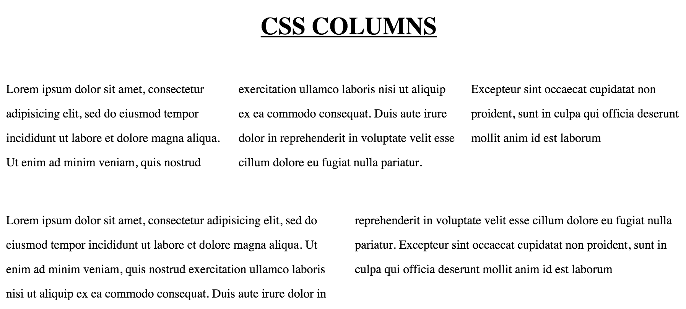

## 3 Hidden CSS Tricks and 3 CSS3 Tutorials

A couple weeks ago, my product team at [ADstruc](https://adstruc.com) gave me a chance to talk about CSS. 

I then took a deeper look at some CSS tricks that I think are rarely discussed by people but still amazing to learn about them.

Here are 3 cool hidden CSS tricks I found that fascinate me and 3 regular CSS3 tutorials.

### 3 CSS Tricks
1. Counters
2. Navigation Separator
3. Columns

#### Counters

If you're a programmer, you will definitely use counter somewhere in your code whether it is PHP, JavaScript, Ruby, or Pyhon.

You can actually do the similar thing in CSS with **counter-reset**, **counter-increment**, and **counter(variableName)**.

If you take a look at the HTML below:
<ol>
	<li>counter-reset:section was used to create a variable named **section** and set the value to 0.</li>
	<li>counter-increment: section was used to increment the section counter by 1.</li>
	<li>counter(section) was used to display the counter.</li>
</ol>

    <!DOCTYPE html>
    <html>
        <head>
            
        </head>

        <body>
            
Lorem Ipsum is simply dummy text of the printing and typesetting industry. Lorem Ipsum has been the industry's standard dummy text ever since the 1500s, when an unknown printer took a galley of type and scrambled it to make a type specimen book. It has survived not only five centuries, but also the leap into electronic typesetting, remaining essentially unchanged. It was popularised in the 1960s with the release of Letraset sheets containing Lorem Ipsum passages, and more recently with desktop publishing software like Aldus PageMaker including versions of Lorem Ipsum.

        </body>
    </html>

#####[Counter Demo](counter.html)

#### Navigation Separator

Sometimes when we are surfing through the internet, we will come across websites with navigation links with separator between them.

##### Solution 1: Most Common Solution :first-child Pseudo-class Selector
Most people who has a working knowledge of CSS will apply border-left on li tags and then use CSS pseudo-class first-child to remove the extra border-left like below:

	li {
        display: inline;
        padding: 0 20px;
		border-left: 1px solid black;
	}
    
    li:first-child {
    	border-left: none;
    }
    
##### My Favorite Solution: Adjacent Selector
	li + li {
		border-left: 1px solid black;
	}
    
Adjacent selector will select only the element that is immediately preceded by the former element. In this case, only the li after another li wil have a black border-left. So if you look at the example below, only **Portfolio** and **Contact** will have a border of left.

    <!DOCTYPE html>
    <html>
        <head>
            
        </head>
        <body>
            <nav>
                <ul>
                    <li>Home</li>
                    <li>Portfolio</li>
                    <li>Contact</li>
                </ul>
            </nav>
        </body>
    </html>
    
#####[Navigation Demo](nav-separator.html)

#### Columns in CSS

With columns in CSS, it is able to separate a block of text for us in columns. 

    <!DOCTYPE html>
    <html>
        <head>
            
        </head>
        <body>

            <h1> CSS COLUMNS </h1>

            
Lorem ipsum dolor sit amet, consectetur adipisicing elit, 
            sed do eiusmod tempor incididunt ut labore et dolore magna aliqua. Ut enim ad minim veniam, 
            quis nostrud exercitation ullamco laboris nisi ut aliquip ex ea commodo consequat. 
            Duis aute irure dolor in reprehenderit in voluptate velit esse cillum dolore eu fugiat 
            nulla pariatur. Excepteur sint occaecat cupidatat non proident, sunt in culpa 
            qui officia deserunt mollit anim id est laborum

            
             

            
Lorem ipsum dolor sit amet, consectetur adipisicing elit, 
            sed do eiusmod tempor incididunt ut labore et dolore magna aliqua. Ut enim ad minim veniam, 
            quis nostrud exercitation ullamco laboris nisi ut aliquip ex ea commodo consequat. 
            Duis aute irure dolor in reprehenderit in voluptate velit esse cillum dolore eu fugiat 
            nulla pariatur. Excepteur sint occaecat cupidatat non proident, sunt in culpa 
            qui officia deserunt mollit anim id est laborum

        </body>
    </html>
    

#####[Columns Demo](columns.html)

### 3 CSS3 Tutorial
1. 3D Button
2. Navigation Separator
3. Columns
